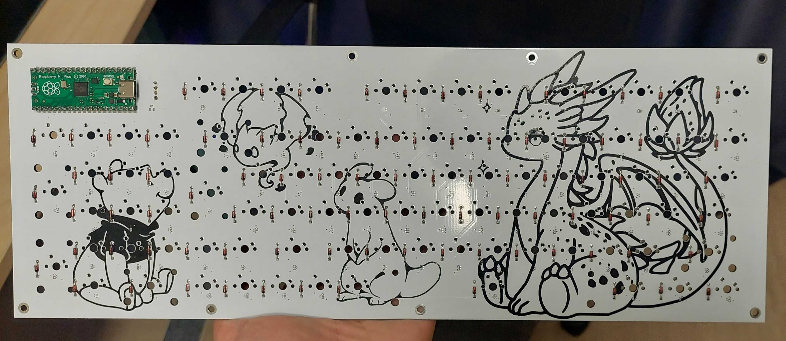

# Keyboard

A full-size keyboard in QMK using the Raspberry PI PICO devboard (RP2040)

* LED: 93x WS2812-2020
* Cap: 93x 100nF 0402
* Diode: 93x DO-35 1N4148
* Res: 1x 0R 0603

Total of 93 keys but has all functions (second layer TBA)

* Keyboard Maintainer: [Kirito](https://github.com/SantaClawzzz)
* Hardware: [Raspberry PI PICO (RP2040)](https://pip-assets.raspberrypi.com/categories/610-raspberry-pi-pico/documents/RP-008307-DS-1-pico-datasheet.pdf?disposition=inline)

### Compile

Set up QMK MSYS and do

    qmk setup

Then if this project is placed in qmk_firmware/keyboards folder all you need to do is

    qmk compile -kb eliikey/firmware -km default

### Flash

You can flash without QMK MSYS 
* Just set it in bootloader and drag in the .uf2 file in this repositories **firmware/flash** folder

Assuming you have QMK set up done you set it in bootloader and run the command. 
Enter bootloader in 3 ways:

* **Bootmagic reset**:          Hold down Escape and plug in the keyboard
* **Physical reset button**:    Hold down the on-board button when plugging the keyboard in
* **Keycode in layout**:        Hold **Fn** and press the numpad **\***

Then in QMK MSYS run

    qmk flash -kb eliikey/firmware -km default

